# Business Process Flowchart: Activity-Based Invoice Proposal Creation

## Microsoft Dynamics 365 Finance & Operations Business Process Catalog Integration

### Process Hierarchy

```mermaid
graph TD
    A["📊 Project to Cash (P2C)<br/>Microsoft Business Process Catalog"] --> B["💼 Project Management<br/>Area: Project Operations"]
    B --> C["💰 Project Invoicing<br/>Process: Invoice and Revenue Recognition"]
    C --> D["🎯 Create Invoice Proposals<br/>Standard Process"]
    D --> E["⭐ Activity-Based Grouping<br/>CUSTOM ENHANCEMENT"]
    
    style A fill:#0078D4,color:#fff
    style B fill:#106EBE,color:#fff
    style C fill:#1E90FF,color:#fff
    style D fill:#4169E1,color:#fff
    style E fill:#FF6B35,color:#fff
```

---

## High-Level Process Flow

```mermaid
flowchart TB
    Start(["🚀 Start: Project Work Complete"]) --> Check1{"Activity Number<br/>Assigned?"}
    
    Check1 -->|"❌ No"| Assign["📝 Assign Activity Number<br/>to Transactions"]
    Check1 -->|"✅ Yes"| Ready["✅ Transactions Ready<br/>for Invoicing"]
    
    Assign --> Ready
    
    Ready --> CreateProposal["🔄 Run Invoice<br/>Proposal Creation"]
    
    CreateProposal --> Filter["🎯 CUSTOM: Filter by Activity<br/>(Extension Point 1)"]
    
    Filter --> Group["📊 CUSTOM: Group by Activity<br/>(Extension Point 2)"]
    
    Group --> Generate["📄 Generate Proposals<br/>One per Activity"]
    
    Generate --> Review["👀 Review Proposals"]
    
    Review --> Approve{"Approved?"}
    
    Approve -->|"✅ Yes"| Post["✉️ Post Invoice"]
    Approve -->|"❌ No"| Adjust["✏️ Adjust or Delete"]
    
    Adjust --> Review
    
    Post --> End(["🎉 End: Customer Invoiced"])
    
    style Start fill:#90EE90
    style End fill:#90EE90
    style Filter fill:#FFD700
    style Group fill:#FFD700
    style Check1 fill:#FFA07A
    style Approve fill:#FFA07A
```

---

## Detailed Technical Process Flow

### Phase 1: Transaction Selection & Filtering

```mermaid
flowchart TD
    A["⚙️ Batch Job Start<br/>ProjInvoiceProposalCreateLines"]
    
    A --> B["📋 Build Selection Queries"]
    
    B --> C1["🕐 Hour Query<br/>(ProjEmplTransSale)"]
    B --> C2["💵 Expense Query<br/>(ProjCostTransSale)"]
    B --> C3["📦 Item Query<br/>(ProjItemTransSale)"]
    B --> C4["💰 Revenue Query<br/>(ProjRevenueTransSale)"]
    B --> C5["💳 OnAccount Query<br/>(ProjOnAccTransSale)"]
    
    C1 --> E1["🎯 Extension: Add Filter<br/>ActivityNumber NOT EMPTY"]
    C2 --> E2["🎯 Extension: Add Filter<br/>ActivityNumber NOT EMPTY"]
    C3 --> E3["🎯 Extension: Add Filter<br/>ActivityNumber NOT EMPTY"]
    C4 --> E4["🎯 Extension: Add Filter<br/>ActivityNumber NOT EMPTY"]
    C5 --> E5["🎯 Extension: Add Filter<br/>ActivityNumber NOT EMPTY"]
    
    E1 --> R1["📊 Execute Query"]
    E2 --> R2["📊 Execute Query"]
    E3 --> R3["📊 Execute Query"]
    E4 --> R4["📊 Execute Query"]
    E5 --> R5["📊 Execute Query"]
    
    R1 --> T["🗃️ Temporary Table<br/>Selected Transactions"]
    R2 --> T
    R3 --> T
    R4 --> T
    R5 --> T
    
    T --> Next["➡️ Phase 2: Grouping"]
    
    style A fill:#4169E1,color:#fff
    style E1 fill:#FFD700
    style E2 fill:#FFD700
    style E3 fill:#FFD700
    style E4 fill:#FFD700
    style E5 fill:#FFD700
    style T fill:#90EE90
```

### Phase 2: Activity-Based Grouping & Proposal Creation

```mermaid
flowchart TD
    Start["📥 Receive Transactions<br/>from Phase 1"]
    
    Start --> Init["🔧 Initialize<br/>- currentActivityNumber = ''<br/>- activityProposalMap = new Map()"]
    
    Init --> Loop{"📋 For Each<br/>Transaction"}
    
    Loop -->|"Next Transaction"| Extract["🔍 Extract Activity<br/>getActivityNumberFromTransaction()"]
    
    Extract --> CheckActivity{"Activity<br/>Changed?"}
    
    CheckActivity -->|"❌ Same Activity"| UseExisting["♻️ Use Current Proposal"]
    CheckActivity -->|"✅ Different Activity"| CheckCache{"In Cache?"}
    
    CheckCache -->|"✅ Cache Hit"| UseCache["⚡ Get from Cache<br/>activityProposalMap.lookup()"]
    CheckCache -->|"❌ Cache Miss"| CheckDB{"In Database?"}
    
    CheckDB -->|"✅ Found"| UseDB["💾 Load from Database<br/>+ Add to Cache"]
    CheckDB -->|"❌ Not Found"| CreateNew["✨ Create New Proposal<br/>+ Set ActivityNumber<br/>+ Add to Cache"]
    
    UseExisting --> AddLines["📝 Add Transaction Lines<br/>to Proposal"]
    UseCache --> AddLines
    UseDB --> AddLines
    CreateNew --> AddLines
    
    AddLines --> Loop
    
    Loop -->|"All Done"| Validate["✅ Validate Consistency<br/>validateProposalActivityConsistency()"]
    
    Validate --> Complete["✅ Complete<br/>Proposals Created"]
    
    style Init fill:#87CEEB
    style CheckCache fill:#FFA07A
    style CheckDB fill:#FFA07A
    style CheckActivity fill:#FFA07A
    style CreateNew fill:#FFD700
    style UseCache fill:#90EE90
    style Complete fill:#90EE90
```

### Phase 3: Validation & Posting

```mermaid
flowchart TD
    Start["📄 Invoice Proposals Created"]
    
    Start --> Display["🖥️ Display in List Page<br/>ProjInvoiceProposalListPage"]
    
    Display --> UserReview["👤 User Reviews Proposals"]
    
    UserReview --> Check1{"Activity<br/>Correct?"}
    
    Check1 -->|"❌ No"| Delete["🗑️ Delete Proposal"]
    Delete --> Fix["✏️ Fix Transaction Activity"]
    Fix --> Recreate["🔄 Recreate Proposal"]
    Recreate --> Display
    
    Check1 -->|"✅ Yes"| Check2{"Amounts<br/>Correct?"}
    
    Check2 -->|"❌ No"| Adjust["✏️ Adjust Lines"]
    Adjust --> Display
    
    Check2 -->|"✅ Yes"| Validate["🔍 System Validation<br/>- Activity consistency<br/>- Amounts<br/>- Required fields"]
    
    Validate --> ValidationResult{"Valid?"}
    
    ValidationResult -->|"❌ Errors"| ShowError["⚠️ Display Errors"]
    ShowError --> UserReview
    
    ValidationResult -->|"✅ Pass"| Post["📤 Post Invoice"]
    
    Post --> UpdateStatus["📊 Update Transaction Status<br/>InvoiceStatus = Invoiced"]
    
    UpdateStatus --> CreateInvoice["📋 Create Customer Invoice<br/>CustInvoiceJour/Trans"]
    
    CreateInvoice --> Revenue["💰 Revenue Recognition<br/>Post to GL"]
    
    Revenue --> Complete["✅ Process Complete"]
    
    style Start fill:#87CEEB
    style Check1 fill:#FFA07A
    style Check2 fill:#FFA07A
    style ValidationResult fill:#FFA07A
    style Complete fill:#90EE90
    style ShowError fill:#FF6B6B
```

---

## Data Flow Diagram

```mermaid
flowchart LR
    subgraph Input["📥 INPUT"]
        T1[("ProjEmplTransSale<br/>Hours")]
        T2[("ProjCostTransSale<br/>Expenses")]
        T3[("ProjItemTransSale<br/>Items")]
        T4[("ProjRevenueTransSale<br/>Fees")]
    end
    
    subgraph Process["⚙️ PROCESSING"]
        F1["🎯 Filter by Activity<br/>(Extension)"] --> G1["📊 Group by Activity<br/>(Extension)"]
        G1 --> C1["💾 Cache Lookup<br/>(Performance)"]
    end
    
    subgraph Output["📤 OUTPUT"]
        P1[("ProjProposalJour<br/>+ ActivityNumber")]
        P2[("ProjProposalEmpl<br/>Hour Details")]
        P3[("ProjProposalCost<br/>Expense Details")]
        P4[("ProjProposalItem<br/>Item Details")]
    end
    
    T1 --> F1
    T2 --> F1
    T3 --> F1
    T4 --> F1
    
    C1 --> P1
    C1 --> P2
    C1 --> P3
    C1 --> P4
    
    style Input fill:#E6F3FF
    style Process fill:#FFF5E6
    style Output fill:#E6FFE6
```

---

## Grouping Logic Visualization

### Standard D365 Grouping (Before Enhancement)

```mermaid
graph TD
    A["All Eligible Transactions"] --> B{"Group By"}
    
    B --> C1["Customer"]
    C1 --> C2["Project"]
    C2 --> C3["Currency"]
    C3 --> C4["Funding Source"]
    
    C4 --> Result["✅ One Proposal<br/>per Combination"]
    
    style A fill:#87CEEB
    style Result fill:#90EE90
```

### Enhanced Grouping (With Activity)

```mermaid
graph TD
    A["Transactions with Activity"] --> B{"Group By"}
    
    B --> C1["Customer"]
    C1 --> C2["Project"]
    C2 --> C3["Currency"]
    C3 --> C4["Funding Source"]
    C4 --> C5["⭐ Activity Number"]
    
    C5 --> Result["✅ Multiple Proposals<br/>One per Activity"]
    
    Excluded["❌ Transactions<br/>WITHOUT Activity"] -.->|"Skipped"| Skip["⚠️ Not Invoiced"]
    
    style A fill:#87CEEB
    style C5 fill:#FFD700
    style Result fill:#90EE90
    style Excluded fill:#FFB6B6
    style Skip fill:#FF6B6B
```

---

## Example Scenario Flow

### Scenario: Multi-Activity Software Project

```mermaid
flowchart TD
    Start["🎯 Project: SOFT-2025<br/>Customer: Contoso Ltd<br/>Currency: USD"]
    
    Start --> T1["📊 Transactions Entered<br/>━━━━━━━━━━━━━━━━━<br/>Design: 40 hours, $6,000<br/>Development: 120 hours, $18,000<br/>Testing: 60 hours, $9,000<br/>Total: 220 hours, $33,000"]
    
    T1 --> Run["▶️ Run Invoice Proposal Creation"]
    
    Run --> Filter["🎯 Filter: All have Activity ✅"]
    
    Filter --> Group["📊 Group by Activity"]
    
    Group --> P1["📄 Proposal #001<br/>━━━━━━━━━━━━━<br/>Activity: Design<br/>Amount: $6,000<br/>Status: Ready"]
    
    Group --> P2["📄 Proposal #002<br/>━━━━━━━━━━━━━<br/>Activity: Development<br/>Amount: $18,000<br/>Status: Ready"]
    
    Group --> P3["📄 Proposal #003<br/>━━━━━━━━━━━━━<br/>Activity: Testing<br/>Amount: $9,000<br/>Status: Ready"]
    
    P1 --> Review["👤 Project Manager Reviews"]
    P2 --> Review
    P3 --> Review
    
    Review --> Decision{"Approve?"}
    
    Decision -->|"Design Only"| Post1["✅ Post Design Invoice<br/>Customer receives $6,000 invoice"]
    Decision -->|"All Three"| PostAll["✅ Post All Invoices<br/>Customer receives 3 invoices<br/>Total: $33,000"]
    
    Post1 --> Remaining["📊 Remaining<br/>Development: $18,000 (Pending)<br/>Testing: $9,000 (Pending)"]
    
    PostAll --> Complete["🎉 All Activities Invoiced"]
    
    style Start fill:#87CEEB
    style P1 fill:#FFE4B5
    style P2 fill:#FFE4B5
    style P3 fill:#FFE4B5
    style Post1 fill:#90EE90
    style PostAll fill:#90EE90
    style Complete fill:#32CD32
```

---

## Microsoft Business Process Catalog Mapping

### Standard Microsoft Processes

```mermaid
graph TB
    subgraph MS["📘 Microsoft Standard Processes"]
        MS1["Project Contracts<br/>Define and Manage"]
        MS2["Project Execution<br/>Time and Material"]
        MS3["Project Invoicing<br/>Create Invoice Proposals"]
        MS4["Revenue Recognition<br/>Post to GL"]
        
        MS1 --> MS2
        MS2 --> MS3
        MS3 --> MS4
    end
    
    subgraph Custom["⭐ Custom Enhancement"]
        C1["Activity Management<br/>Define Activities"]
        C2["Activity Assignment<br/>On Transactions"]
        C3["Activity Filtering<br/>Proposal Creation"]
        C4["Activity Grouping<br/>Separate Proposals"]
        
        C1 --> C2
        C2 --> C3
        C3 --> C4
    end
    
    MS2 -.->|"Uses"| C1
    MS2 -.->|"Requires"| C2
    MS3 -.->|"Extended by"| C3
    MS3 -.->|"Enhanced with"| C4
    
    style MS fill:#E6F3FF
    style Custom fill:#FFF5E6
    style C3 fill:#FFD700
    style C4 fill:#FFD700
```

### Integration Points

| Microsoft Process | Integration Point | Custom Enhancement |
|------------------|-------------------|--------------------|
| **Project Setup** | Activity definition | Standard activity table, custom grouping rules |
| **Time Entry** | Transaction creation | Activity mandatory for invoicing |
| **Expense Entry** | Transaction creation | Activity mandatory for invoicing |
| **Proposal Creation** | ProjInvoiceProposalCreateLines | Filter by ActivityNumber (CoC) |
| **Proposal Grouping** | ProjInvoiceProposalInsertLines | Group by ActivityNumber (CoC) |
| **Invoice Posting** | Standard posting | ActivityNumber carried through |
| **Revenue Recognition** | Standard GL posting | Activity-based tracking available |

---

## Swimlane Diagram: Roles & Responsibilities

---

## Error Handling Flow

```mermaid
flowchart TD
    Start["⚙️ Proposal Creation Started"]
    
    Start --> Check1{"All Transactions<br/>Have Activity?"}
    
    Check1 -->|"❌ No"| Warn1["⚠️ Warning<br/>X transactions skipped<br/>No Activity Number"]
    Check1 -->|"✅ Yes"| Process["✅ Process All<br/>Transactions"]
    
    Warn1 --> Log1["📋 Log to InfoLog<br/>List skipped transactions"]
    Log1 --> Partial["⚡ Partial Processing<br/>Create proposals for<br/>transactions with activity"]
    
    Process --> Create["📄 Create Proposals"]
    Partial --> Create
    
    Create --> Validate{"Validation<br/>Pass?"}
    
    Validate -->|"❌ Fail"| Error1["❌ Error<br/>Activity mismatch<br/>between header and lines"]
    Validate -->|"✅ Pass"| Success["✅ Success<br/>Proposals created"]
    
    Error1 --> Log2["📋 Log Error Details"]
    Log2 --> Rollback["↩️ Rollback<br/>Transaction"]
    Rollback --> Alert["🔔 Alert User<br/>Require investigation"]
    
    Success --> Summary["📊 Display Summary<br/>- Transactions processed<br/>- Proposals created<br/>- Warnings (if any)"]
    
    style Check1 fill:#FFA07A
    style Validate fill:#FFA07A
    style Warn1 fill:#FFD700
    style Error1 fill:#FF6B6B
    style Success fill:#90EE90
    style Summary fill:#90EE90
```

---

## Performance Optimization Flow

```mermaid
flowchart TD
    Start["🚀 Process Transaction"]
    
    Start --> Extract["🔍 Extract Activity<br/>from Transaction"]
    
    Extract --> BuildKey["🔑 Build Cache Key<br/>Project|Currency|Funding|Activity"]
    
    BuildKey --> CheckCache{"🗄️ In Memory<br/>Cache?"}
    
    CheckCache -->|"✅ Cache Hit"| UseCache["⚡ Fast Path<br/>Retrieve from Map<br/>< 1ms"]
    CheckCache -->|"❌ Cache Miss"| CheckDB{"💾 In Database?"}
    
    CheckDB -->|"✅ Found"| QueryDB["🐌 Query Database<br/>~ 50-100ms"]
    CheckDB -->|"❌ Not Found"| CreateNew["✨ Create New Proposal<br/>~ 100-200ms"]
    
    QueryDB --> AddCache1["📥 Add to Cache"]
    CreateNew --> AddCache2["📥 Add to Cache"]
    
    UseCache --> UseProp["📝 Use Proposal"]
    AddCache1 --> UseProp
    AddCache2 --> UseProp
    
    UseProp --> Stats["📊 Update Metrics<br/>- Cache Hits<br/>- Cache Misses<br/>- Response Times"]
    
    Stats --> Done["✅ Transaction Added"]
    
    style CheckCache fill:#FFA07A
    style CheckDB fill:#FFA07A
    style UseCache fill:#90EE90
    style QueryDB fill:#FFD700
    style CreateNew fill:#FFB6B6
    style Done fill:#90EE90
```

---

## Deployment & Rollback Flow

```mermaid
flowchart TD
    Start(["🎬 Start Deployment"])
    
    Start --> Backup["💾 Backup Database<br/>& Current Code"]
    
    Backup --> Validate["✅ Run Validation Scripts<br/>- Verify ActivityNumber fields<br/>- Check data integrity"]
    
    Validate --> Result1{"Validation<br/>Pass?"}
    
    Result1 -->|"❌ Fail"| Fix["🔧 Fix Issues<br/>- Add missing fields<br/>- Assign activities"]
    Fix --> Validate
    
    Result1 -->|"✅ Pass"| Deploy["📦 Deploy Extension<br/>- Table extension<br/>- Class extensions<br/>- Form extensions"]
    
    Deploy --> Compile["⚙️ Full Compile"]
    
    Compile --> CompileResult{"Compile<br/>Success?"}
    
    CompileResult -->|"❌ Fail"| RollbackCode["↩️ Rollback Code<br/>Remove extension"]
    CompileResult -->|"✅ Pass"| Sync["🔄 Database Sync"]
    
    Sync --> Test["🧪 Smoke Test<br/>- Create sample proposal<br/>- Verify activity grouping"]
    
    Test --> TestResult{"Test<br/>Pass?"}
    
    TestResult -->|"❌ Fail"| Investigate{"Critical<br/>Issue?"}
    TestResult -->|"✅ Pass"| GoLive["🚀 Go Live<br/>Enable for all users"]
    
    Investigate -->|"Yes"| RollbackFull["⚠️ Full Rollback<br/>- Restore database<br/>- Restore code<br/>- Notify stakeholders"]
    Investigate -->|"No"| Hotfix["🔥 Deploy Hotfix<br/>Fix minor issue"]
    
    Hotfix --> Test
    
    RollbackCode --> RollbackDone["🔄 Rollback Complete<br/>Investigate issues"]
    RollbackFull --> RollbackDone
    
    GoLive --> Monitor["👀 Monitor<br/>- Performance<br/>- Errors<br/>- User feedback"]
    
    Monitor --> Success(["✅ Deployment Complete"])
    
    style Start fill:#90EE90
    style Result1 fill:#FFA07A
    style CompileResult fill:#FFA07A
    style TestResult fill:#FFA07A
    style Investigate fill:#FFA07A
    style RollbackFull fill:#FF6B6B
    style Success fill:#32CD32
```

---

## Quick Reference: Process Steps

### Step-by-Step User Process

1. **📝 Enter Transactions** → Assign Activity Number (mandatory)
2. **✅ Mark Ready** → Set transaction status to "Ready to invoice"
3. **🔄 Run Batch** → Execute invoice proposal creation job
4. **🎯 System Filters** → Only transactions with Activity Number selected
5. **📊 System Groups** → Separate proposal created per activity
6. **👀 Review** → Project Manager/Accountant reviews proposals
7. **✏️ Adjust** → Make corrections if needed
8. **✅ Approve** → Mark proposals ready to post
9. **📤 Post** → System creates customer invoices
10. **💰 Recognize** → Revenue posted to General Ledger

---

**Document Version**: 1.0  
**Last Updated**: 2025-11-16  
**Format**: Mermaid Flowcharts (GitHub Compatible)  
**Viewing**: Open in GitHub for automatic rendering
